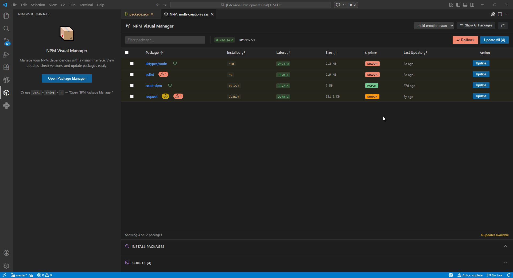
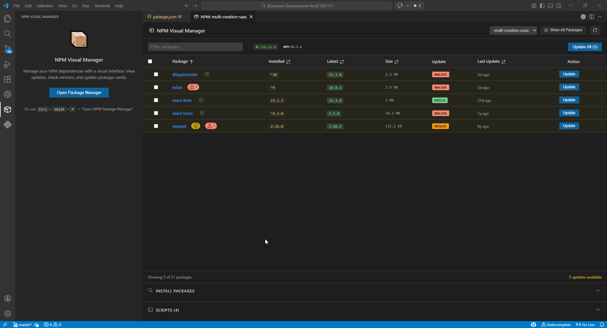
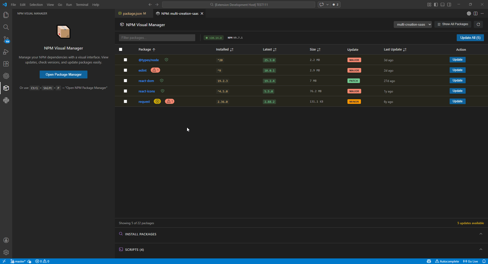

# NPM Visual Manager

A Visual Studio Code extension that provides a visual interface for managing NPM dependencies, inspired by the NuGet Package Manager in Visual Studio.

## Screenshots

### Ignore Packages & Show All Packages
Click the eye icon 👁️ to ignore packages from update checks. Use "Show All Packages" to toggle between outdated-only and all packages view.



### Search & Install Packages
Search for new packages in the NPM registry and install them directly from the UI.



### Update Packages
One-click updates for individual packages with automatic version checking.



## Features

- 📊 **Visual Dependency Table**: View all dependencies (production, development, and peer) in a clean, sortable table
- 🔍 **Search & Install Packages**: Search NPM registry and install new packages directly from the UI
- 👁️ **Ignore Packages**: Exclude packages from update checks with a click
- 📖 **Changelog Viewer**: Click the book icon to view package releases on GitHub
- ⚠️ **Version Mismatch Detection**: Visual indicator when installed version differs from package.json
- 🔄 **Version Checking**: Automatically checks for latest versions from the NPM registry
- ⬆️ **One-Click Updates**: Update individual packages or all outdated packages at once
- 🛡️ **Security Audit**: Shows vulnerability counts from `npm audit`
- ↩️ **Rollback Support**: Restore previous versions if an update breaks something
- 🏢 **Multi-Project**: Detects all package.json files in monorepos
- 📦 **Multiple Package Managers**: Auto-detects and uses npm, yarn, pnpm, or bun
- 📏 **Package Size**: Shows estimated package sizes
- 🏷️ **Semver Badges**: Visual indicators for MAJOR, MINOR, and PATCH updates
- 🔍 **Filtering & Search**: Filter by dependency type and search by package name
- 🎨 **Theme-Aware UI**: Uses VS Code's native CSS variables for seamless integration
- ⚡ **Fast & Lightweight**: Built with React and Vite for optimal performance

## Requirements

- VS Code 1.85.0 or higher
- Node.js project with a `package.json` file
- NPM installed

## Installation

1. Install dependencies:
```bash
npm run install:all
```

2. Build the extension:
```bash
npm run vscode:prepublish
```

3. Press `F5` to open a new Extension Development Host window

4. Open a Node.js project and run the command `Open NPM Package Manager`

## Usage

### Opening the Package Manager

- **Command Palette**: Press `Ctrl+Shift+P` (or `Cmd+Shift+P` on Mac) and type "Open NPM Package Manager"
- **Context Menu**: Right-click on `package.json` in the Explorer and select "Open NPM Package Manager"

### Managing Dependencies

1. **View Dependencies**: The table shows all packages with their installed and latest versions
2. **Check for Updates**: The extension automatically checks npm registry for latest versions
3. **Update Packages**:
   - Click "Update" on individual packages
   - Use "Update All" button to update all outdated packages at once

### Filtering

- **Search**: Type in the filter box to search by package name
- **Type Filter**: Use the dropdown to show only Production, Development, or Peer dependencies

### Search & Install Packages

Expand the "INSTALL PACKAGES" section, type a package name (min. 2 characters), and click on a result to install it. You can choose to install as a regular dependency or dev dependency.

### Ignore Packages

Click the eye icon 👁️ next to any package to ignore it from update checks. Ignored packages won't appear in the "updates available" counter. Click "Show All Packages" to toggle between viewing only outdated packages or all packages.

### Changelog Viewer

Hover over any package row and click the book icon 📖 to open the package's GitHub releases page. This helps you review what changed before updating.

## Architecture

```
npm-visual-manager/
├── src/                          # Extension Host (Node.js)
│   ├── core/                     # Core functionality
│   │   ├── extension.ts          # Entry point
│   │   ├── webviewPanel.ts       # Webview panel management
│   │   └── types.ts              # Shared types
│   ├── services/                 # Business logic
│   │   ├── npmService.ts         # NPM registry API
│   │   ├── searchService.ts      # Package search API
│   │   ├── packageService.ts     # package.json operations
│   │   └── packageManagerService.ts  # Package manager commands
│   └── utils/                    # Utilities
│       └── cache.ts              # Version caching
├── webview-ui/                   # React Application
│   ├── src/
│   │   ├── components/           # React components
│   │   ├── hooks/                # Custom hooks
│   │   ├── App.tsx               # Main component
│   │   └── main.tsx              # Entry point
│   ├── index.html
│   ├── package.json
│   ├── tsconfig.json
│   └── vite.config.ts
├── out/                          # Compiled output
│   ├── extension.js              # Compiled extension
│   └── webview/                  # Built React app
│       └── assets/
├── resources/                    # Icons and assets
└── package.json                  # Extension manifest
```

## Development

### Project Structure

- **Extension Host** (`src/`): Handles VS Code API, file system operations, and NPM registry communication
- **Webview UI** (`webview-ui/`): React application running inside the webview panel
- **Communication**: Uses `acquireVsCodeApi()` for bidirectional message passing

### Available Scripts

```bash
# Install all dependencies
npm run install:all

# Build everything for production
npm run vscode:prepublish

# Build webview in development mode
npm run build:webview:dev

# Watch TypeScript compilation
npm run watch
```

### Message Protocol

**Webview → Host:**
- `GET_DEPENDENCIES`: Request package.json dependencies
- `CHECK_UPDATES`: Request version check for dependencies
- `UPDATE_PACKAGE`: Request single package update
- `UPDATE_ALL_PACKAGES`: Request batch update
- `SEARCH_PACKAGES`: Search NPM registry for packages
- `INSTALL_NEW_PACKAGE`: Install a new dependency
- `TOGGLE_IGNORE_PACKAGE`: Toggle ignore status for a package
- `REFRESH_CACHE`: Clear version cache

**Host → Webview:**
- `DEPENDENCIES_DATA`: Send dependency list
- `VERSION_CHECK_RESULT`: Send latest version for a package
- `UPDATE_RESULT`: Confirm update initiation
- `SEARCH_RESULTS`: Send package search results
- `IGNORE_TOGGLED`: Confirm ignore status change
- `CACHE_CLEARED`: Confirm cache cleared
- `PROGRESS`: Show progress message
- `ERROR`: Report errors

## Extension Settings

This extension contributes the following settings:

- `npm-visual-manager.columns.size`: Show Size column (default: true)
- `npm-visual-manager.columns.type`: Show Type column (default: false)
- `npm-visual-manager.columns.lastUpdate`: Show Last Update column (default: true)
- `npm-visual-manager.columns.security`: Show Security column (default: true)
- `npm-visual-manager.columns.semverUpdate`: Show Update Type column (default: true)

## Known Issues

- Progress tracking during `npm install` is limited (terminal opens but progress isn't streamed back)
- Large projects with many dependencies may take time to check all versions

## Roadmap

- [x] ~~Install new packages via search interface~~ ✅ Added in v0.4.0
- [ ] Export dependency report
- [ ] Dependency usage analysis (find unused packages)
- [ ] Changelog preview before updating

## Contributing

Contributions are welcome! Please feel free to submit a Pull Request.

## License

MIT License - see LICENSE file for details.

## Acknowledgments

- Inspired by Visual Studio's NuGet Package Manager
- Uses VS Code Webview UI Toolkit design principles
- Built with React and Vite
