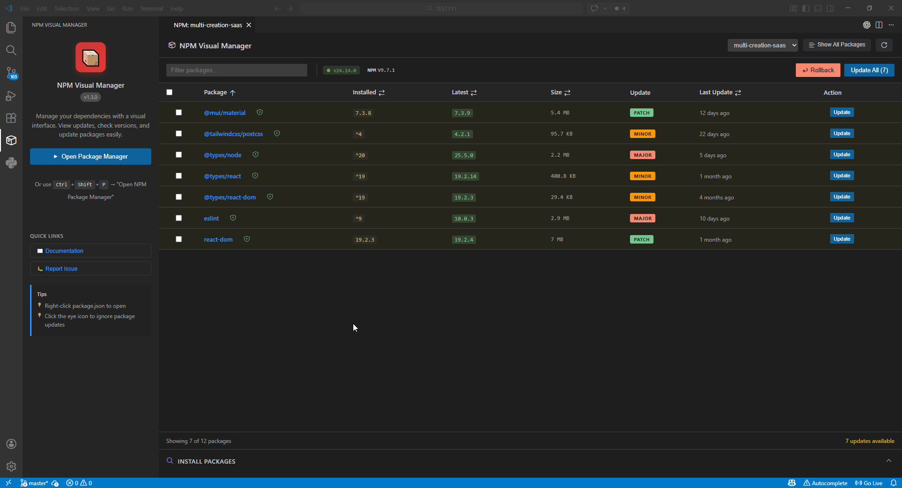

# NPM Visual Manager

A Visual Studio Code extension that provides a visual interface for managing NPM dependencies, inspired by the NuGet Package Manager in Visual Studio.

## Screenshots

## Features

| Category | Capabilities |
|----------|-------------|
| **Dependency Management** | Visual table with sorting, filtering by type (prod/dev/peer), auto-refresh on `package.json` changes |
| **Search & Install** | NPM registry search with debouncing, install as regular or dev dependency |
| **Updates** | One-click individual or bulk updates, version rollbacks, ignore packages from checks |
| **Security & Info** | Security audit integration, deprecation warnings, package sizes, direct links to changelogs, "why is it installed?" reverse dependency view |
| **Multi-Project** | Auto-detection in monorepos, project selector showing each `package.json` path, supports npm, yarn, pnpm, and bun |
| **Localization** | 8 languages: Spanish, German, French, Chinese (Simplified), Japanese, Portuguese, Russian, Korean |
| **UI** | Native VS Code theme integration, customizable columns, activity bar badge with pending updates/vulnerabilities |

## Requirements

- VS Code 1.85.0 or higher
- Node.js project with a `package.json` file
- Package manager installed (npm, yarn, pnpm, or bun)

## Installation

Install from the [VS Code Marketplace](https://marketplace.visualstudio.com/items?itemName=LuisClementDev.npm-visual-manager) or search for "NPM Visual Manager" in the Extensions panel (`Ctrl+Shift+X`).

Also available on [Open VSX Registry](https://open-vsx.org/extension/LuisClementDev/npm-visual-manager) for VSCodium and other compatible editors.

## Usage

### Opening the Package Manager

- **Command Palette**: Press `Ctrl+Shift+P` (or `Cmd+Shift+P` on Mac) and type "Open NPM Package Manager"
- **Context Menu**: Right-click on `package.json` in the Explorer and select "Open NPM Package Manager"

### Managing Dependencies

1. **View Dependencies**: The table shows all packages with their installed and latest versions
2. **Check for Updates**: The extension automatically checks npm registry for latest versions
3. **Update Packages**:
   - Click "Update" on individual packages
   - Use "Update All" button to update all outdated packages at once

### Which package.json is being managed

Repos often hold more than one `package.json` (a monorepo, a WordPress theme plus its plugins, a site with its own build folder). The header always shows the target file as a path chip next to the project selector; click it to open that file. The editor tab title, every confirmation dialog and every progress notification name the same path, so an update can never land on a file you did not expect. When several projects are detected, the selector switches between them and the "Updates" view lists the pending updates per `package.json`. Projects are discovered up to five folder levels deep; if one of yours is missing, raise `npm-visual-manager.scan.maxDepth`.

### Filtering

- **Search**: Type in the filter box to search by package name
- **Type Filter**: Use the dropdown to show only Production, Development, or Peer dependencies

### Search & Install Packages

Expand the "INSTALL PACKAGES" section, type a package name (min. 2 characters), and click on a result to install it. You can choose to install as a regular dependency or dev dependency.

**Smart Detection**: When searching for a package that is already installed in your project, the button will change to "Uninstall" with a confirmation dialog.

### Ignore Packages

Click the eye icon 👁️ next to any package to ignore it from update checks. Ignored packages won't appear in the "updates available" counter. Click "Show All Packages" to toggle between viewing only outdated packages or all packages.

### Changelog Viewer

Hover over any package row and click the book icon 📖 to open the package's GitHub releases page. This helps you review what changed before updating.

## Extension Settings

This extension contributes the following settings:

- `npm-visual-manager.columns.size`: Show Size column
- `npm-visual-manager.columns.type`: Show Type column
- `npm-visual-manager.columns.lastUpdate`: Show Last Update column
- `npm-visual-manager.columns.security`: Show Security column
- `npm-visual-manager.columns.semverUpdate`: Show Update Type column
- `npm-visual-manager.badge.enabled`: Show a badge on the activity bar icon with the number of available updates and vulnerable packages
- `npm-visual-manager.scan.maxDepth`: How many folder levels below the workspace root are searched for `package.json` files (default `5`)
- `npm-visual-manager.scan.excludeFolders`: Folder names never searched (defaults to `node_modules`, `bower_components`, `vendor`, `uploads`, `dist`, `out`, `coverage`, `tmp`, `temp`; dotted folders are always skipped)

## Contributing

Contributions are welcome! Please feel free to submit a Pull Request.

## License

MIT License - see LICENSE file for details.

## Acknowledgments

- Inspired by Visual Studio's NuGet Package Manager
- Uses VS Code Webview UI Toolkit design principles
- Built with React and Vite